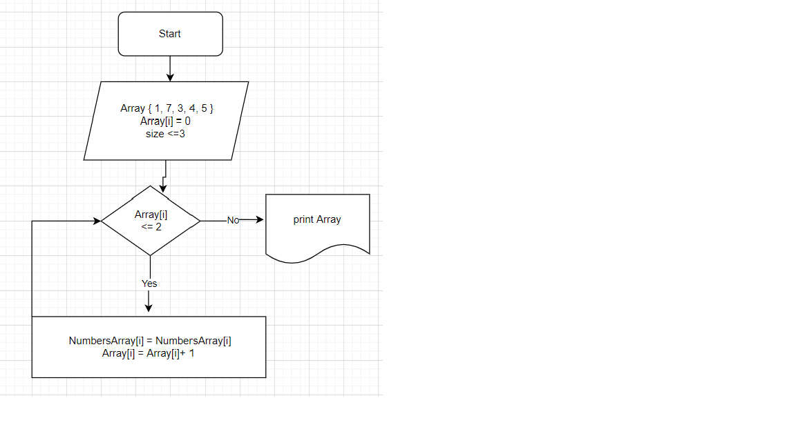

## Блок-схема

## Решение задания

+ Для начала обозначаем формат массива, назавание и элементы массива.
+ Далее обозначаем значение стартового индекса
+ Запускаем цикл **While** с условием до какого момента будет продолжаться цикл.
+ В цикле прописываем какие элементы будут выводиться
